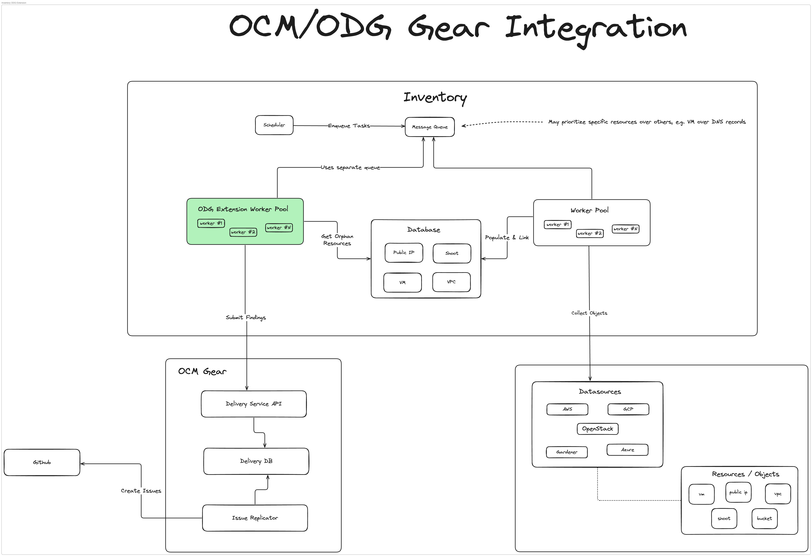

# inventory-extension-odg

`inventory-extension-odg` is an extension for
[gardener/inventory](https://github.com/gardener/inventory), which provides
integration with Open Delivery Gear.

Orphan resources discovered by Inventory will be submitted by the
`inventory-extension-odg` extension to the Delivery Service API as findings.

The following diagram provides a high-level overview of how the extension plugs
into the existing [gardener/inventory](https://github.com/gardener/inventory)
architecture.

TODO: Fill me in

# Requirements

TODO: Fill me in

# Documentation

TODO: Fill me in

# License

This project is Open Source and licensed under [Apache License 2.0](https://www.apache.org/licenses/LICENSE-2.0).
